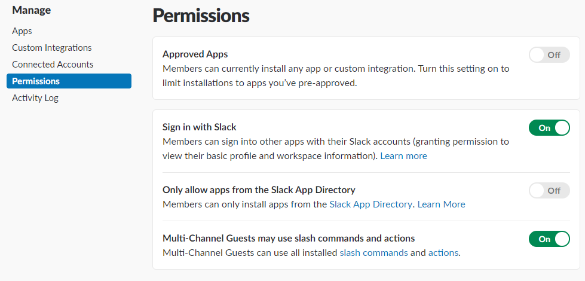

# Table of Contents

<!-- toc -->

- [Utilities](#utilities)
  * [bucketfs_ls](#bucketfs_ls)
  * [check_connectivity](#check_connectivity)
  * [language_info](#language_info)
  * [pub2slack](#pub2slack)

<!-- tocstop -->

# Utilities 

## bucketfs_ls ([bucketfs_ls.sql](bucketfs_ls.sql))
This UDF can be used to list the content (i.e. the folders and files) of a [BucketFS](https://docs.exasol.com/administration/on-premise/bucketfs/bucketfs.htm) bucket (or a folder inside it).

Usage:
```sql
SELECT bucketfs_ls('/buckets/bfsdefault');
```
NOTE: The root of BucketFS is `/buckets/bfsdefault`.

The UDF is calling Unix/Linux `ls -F` command and thus the usual wildcard characters can be used in the path.

[BuckerFS Explorer](https://github.com/exasol/bucketfs-explorer) is GUI application that allows not only to inspect the content of BucketFS, but also upload and delete files and change settings.

## check_connectivity ([check_connectivity.sql](check_connectivity.sql))
Use this UDF to check if a host and a specific port on that host is accessible. This can be useful when investigating issues e.g. during ETL/ELT processes when data needs to be imported from a remote database.

Usage:
```sql
SELECT check_connectivity('oraclesrv1.company.com', '1521');
```

## language_info ([language_info.sql](language_info.sql))
These UDFs list the available information of their langauge environment, including the name and &ndash; if available &ndash; the version of the libraries/modules/packages supplied with them. You can use these to check if the language version is compatible with your code, and if the libraries/modules/packages required by your code are available.

All UDFs expect a single Boolean parameter. `TRUE` indicates to retrieve all available information, while `FALSE` only produces the language version. 

Usage:
```sql
SELECT r_info(TRUE);
SELECT python_info(TRUE);
SELECT python3_info(TRUE);
SELECT lua_info(TRUE);
SELECT java_info(TRUE);
```
NOTE: `python3_info()` is only available (out of the box) in Exasol 6.2 and later version. 

## pub2slack ([pub2slack.sql](pub2slack.sql))
This feature allows you to publish messages to a Slack channel. This could be a useful functionality during ETL/ELT processes  when the execution encountered an error or during in-database analytics when something interesting or suspicios was detected.

This functionality requires an initial setup and administrative maintenance afterwards.
* First, the administrators of your Slack environment need to invite you to the workspace as full member and need to ensure that [all apps are allowed](https://exasol-sandbox.slack.com/apps/manage/permissions):

* Next, you need to create an application in Slack, enable incoming webhooks and then create one. The [details of these steps](https://api.slack.com/incoming-webhooks) can be found on the Slack API documentation site.
* Once these are done, you need to configure the control of access to the webhooks in the database as most likely you do not want to permit everyone to send messages to arbitrary channels in your workspace. Furthermore, webhooks are non-humar readable information (e.g. `TE100F6H2/BENTD9WD6/VByhPjjLtM5RJdSqXexKhgUc`), so it is better to provide a memorable alias for them.
 * To set up authorisation, first you need to create roles in the database, one for each Slack channel/webhook, e.g. for the "General" channel:
```sql
CREATE ROLE slack_general;
```
 * Then you need to grant these roles to the approved users:
```sql
GRANT ROLE slack_general TO etl_user;
```
 * Then you need to associate each channel/webhook with the alias and the role by inserting the details into the `pub2slack_channels` table:
```sql
    INSERT INTO pub2slack_channels VALUES ('general',  'TE100F6H2/BENTD9WD6/VByhPjjLtM5RJdSqXexKhgUc', 'slack_general');
    INSERT INTO pub2slack_channels VALUES ('slackbot', 'TE100F6H2/BE1KQFTA7/L4SVD0dAvWrO1fEbhEY4hsi0', NULL);
```
NOTE: if `NULL` is provided for role, then anyone can publish into the channel.
* After everything above is done, you can start publishing messages:
```
EXECUTE SCRIPT pub2slack('general','Test');
```
 * Make sure that your endusers have `EXECUTE` privilege on `pub2slack()` and no other privileges are provided (e.g. any kind of privilege on the `pub2slack_channels` table).
 * `pub2slack()` is a wrapper Lua script to make the use of this functionality simple. It checks the validity of input parameters, access right to the channel; and it retrieves the webhook to call the inner Python UDF `pub2slackfn()` that provides the actual communication service. 
